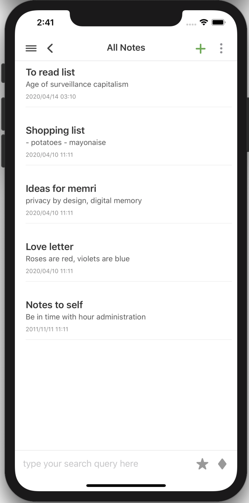
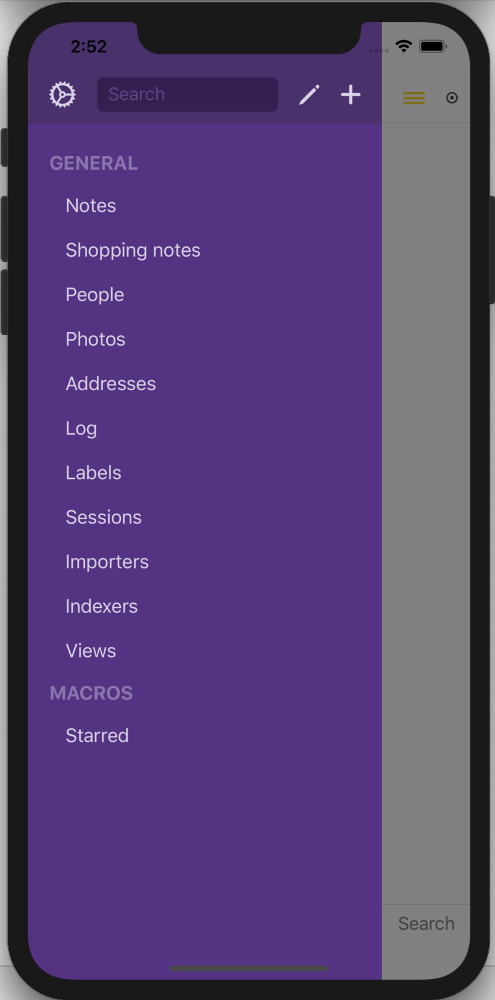
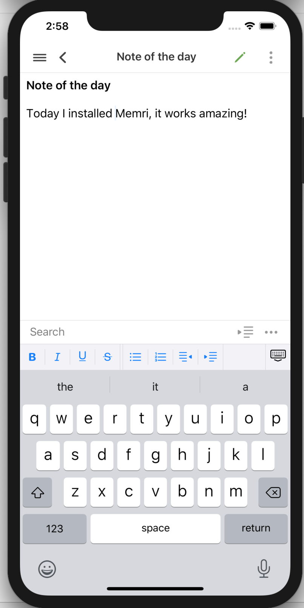

# iOS application

This is the repository for Memri's iOS and macOS app. This application can be used to connect to your [pod](https://gitlab.memri.io/memri/pod) to browse and use your data.

Unless you are using our Testflight release, Xcode is required to build and run the app (requires macOS). To run the app open the project in Xcode and run in a simulator.

<p float="left">
  
   
  
</p>

## Developer

### Documentation
```[sudo] gem install jazzy```

#### Run formatter
If you make changes to the repository, please build the `Memri+BuildTools` scheme in Xcode before making a merge request. This will run the code formatter so that your changes are consistent with our code formatting style. The first time you run this may take a while as Xcode will download the `SwiftFormat` tool into the project folder.

## Defining your own interface
The iOS application uses **Cascading Views** for defining the interfaces in the app. If you are interested in making your own interface for your data, check out the [list of supported cvu definitions](https://gitlab.memri.io/memri/memri/-/wikis/List-of-supported-CVU-definitions) and the [cvu expression language](https://gitlab.memri.io/memri/memri/-/wikis/CVU-Expression-Language)


